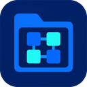
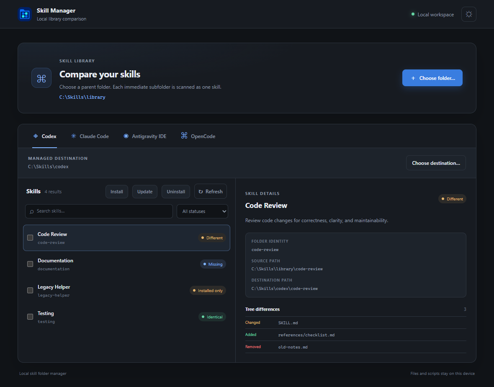
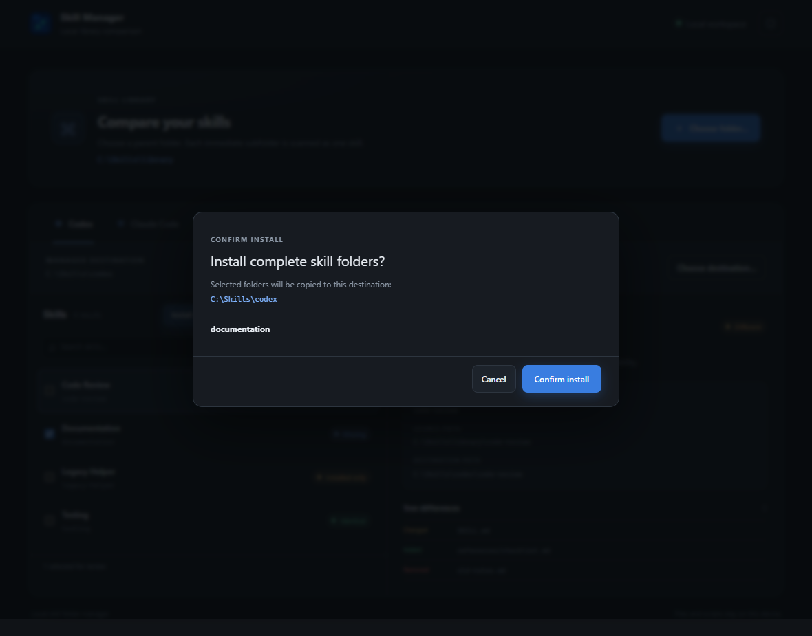
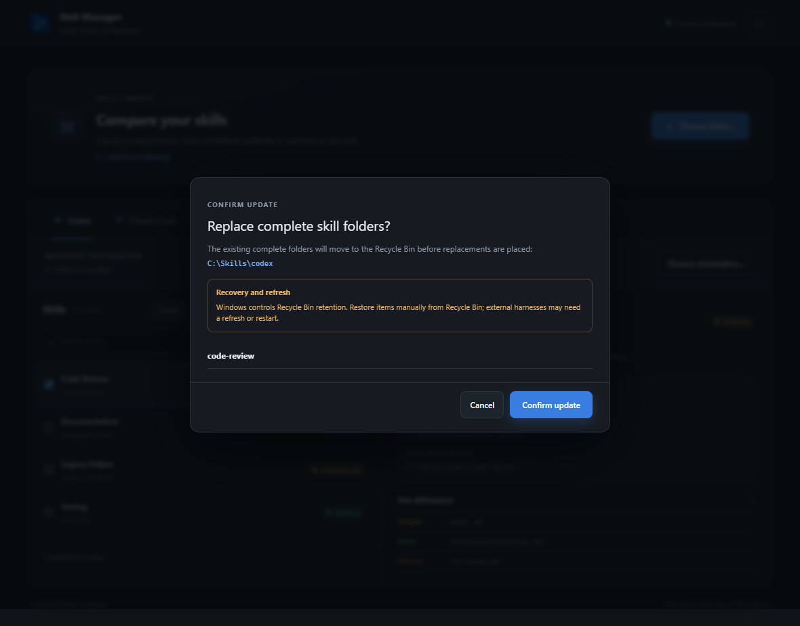
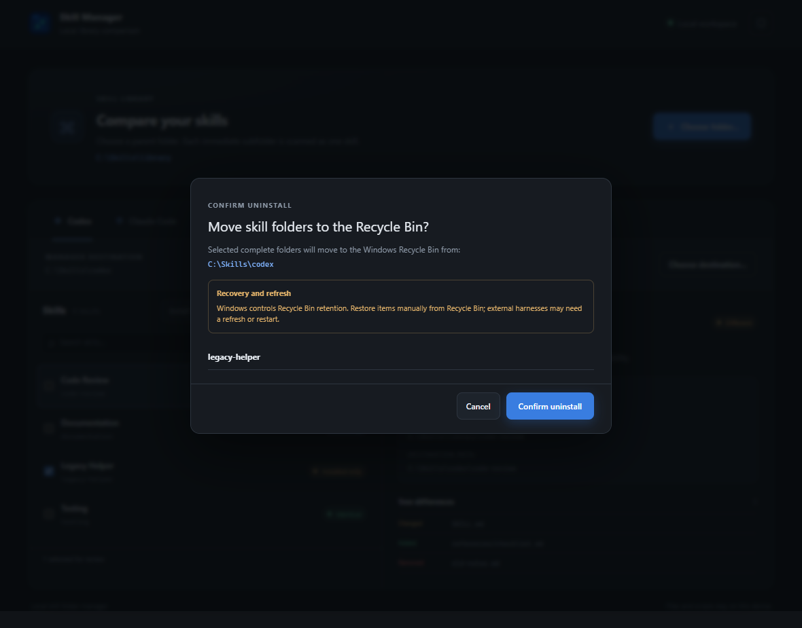

# ⚡ AI Skill Manager



[](https://github.com/Thiagojm/ai-skill-manager-rs)
[](https://tauri.app/)
[](https://www.rust-lang.org/)
[](https://svelte.dev/)
[](LICENSE)
[](https://github.com/Thiagojm/ai-skill-manager-rs/releases)

A fast, reliable, and user-friendly Windows desktop application to discover, compare, install, update, and manage local AI skills across your coding assistants.

Managing skills across multiple AI tools usually means manual folder copying, guessing which version is installed where, and risking accidental overwrites. **AI Skill Manager** solves this with a centralized, visual dashboard designed for seamless multi-agent skill maintenance.

---

## ✨ Features

- 🎯 **Multi-Agent Central Hub**: Dedicated tabs for **OpenAI Codex**, **Anthropic Claude Code**, **Google Antigravity IDE**, and **OpenCode**, each with independent destination folder configuration.
- 🔍 **Deep Whole-Tree Comparison**: Compares full directory trees — including nested files, helper scripts, configuration assets, empty directories, and hidden resources.
- 🛡️ **Safe & Non-Destructive Operations**:
  - **Verified Staging**: Prepares and validates replacements before changing the installed folder. If placement fails after recycling, the app reports recovery paths.
  - **Recycle Bin Integration**: Uninstalled or replaced folders are safely moved to the Windows Recycle Bin via native Windows Shell operations (`IFileOperation`), never permanently deleted.
  - **Link Protection**: Safeguards directory junctions and symbolic links without mutating external targets.
- ⚡ **Parallel Scanning**: Up to four inventory workers and an in-memory source snapshot reduce repeated work when switching tabs. Use **Refresh** after changing source files externally.
- 🎨 **Modern & Accessible UI**: Clean dark and light modes, instant search by skill title or directory ID, status filtering, and keyboard navigation.

---

## 🤖 Supported AI Agents

AI Skill Manager automatically resolves standard skill installation paths for popular coding assistants:

| Agent / Harness | Default Managed Location | Custom Override |
| :--- | :--- | :---: |
| **OpenAI Codex** | `$CODEX_HOME/skills` *(or `~/.codex/skills`)* | ✅ Yes |
| **Anthropic Claude Code** | `~/.claude/skills` | ✅ Yes |
| **Google Antigravity IDE** | `~/.gemini/config/skills` | ✅ Yes |
| **OpenCode** | `~/.config/opencode/skills` *(respects `XDG_CONFIG_HOME`)* | ✅ Yes |

> [!NOTE]
> Custom destination paths and chosen themes are automatically saved and restored on subsequent launches.

Built-in tabs appear when their configuration folder or a saved destination exists. To manage another tool, select **Add harness**, enter a name, choose its existing skills folder, then click **Add harness**. The registration is saved locally and remains visible if that folder later becomes unavailable. Select a custom tab and use **Choose destination…** to repair its path or **Manage harness** to rename or remove it. Removing a registration only clears its saved name and path; it never deletes the skills folder or its contents.

---

## 🔄 Understanding Skill Statuses

When scanning your source folder against an agent's destination, each skill is classified with an actionable status:

| Status | Meaning | Available Actions |
| :--- | :--- | :--- |
| 🟡 **Missing** | Present in source, not yet installed in the agent destination. | **Install** |
| 🟢 **Identical** | Fully synchronized; complete trees and file contents match. | **Uninstall** |
| 🔵 **Different** | Exists in both locations, but contents or structures differ. | **Update** (Clean Replacement), **Uninstall** |
| ⚪ **Installed only** | Exists only in the agent destination (absent from source). | **Uninstall** |

---

## 🚀 Getting Started

### Option 1: Pre-built Windows Installer (Recommended)

1. Download the latest installer (`AI Skill Manager_x.x.x_x64-setup.exe`) from the [Releases](https://github.com/Thiagojm/ai-skill-manager-rs/releases) page.
2. Run the installer and follow the setup wizard.
3. Launch **AI Skill Manager**, choose your skills source folder, and start managing!

### Option 2: Running from Source

#### Prerequisites
- **Node.js**: `24.x` or newer (with `npm 12+`)
- **Rust**: `1.98.x` or newer (with Cargo)
- **Operating System**: Windows 10/11 x64

#### Quick Start
```powershell
# Clone the repository
git clone https://github.com/Thiagojm/ai-skill-manager-rs.git
cd ai-skill-manager-rs

# Install frontend dependencies
npm.cmd ci

# Start the desktop application in development mode
npm.cmd run tauri dev
```

---

## 📖 Quick Tutorial

Screenshots show the current app interface in a browser with demonstration data and example paths. They illustrate the workflow; they are not native installer or filesystem-operation test results.

### 1. Choose your library and destination

Click **Choose folder…** and select the parent folder containing your skills. Each immediate subfolder is treated as one skill and should contain a readable `SKILL.md`:

```text
library/
  code-review/
    SKILL.md
    references/
  documentation/
    SKILL.md
```

The app remembers the last successfully selected source. Use the same button whenever you want another library. Choose a harness tab, then check **Managed destination**; **Choose destination…** changes that tab's saved destination. Merely opening a missing destination does not create it.



### 2. Compare and select skills

Search by name or folder identity, or use **All statuses** to filter. Click a skill name to inspect its paths, metadata warnings, links, and **Tree differences**. Added/removed/changed paths describe what would change when replacing the destination with the source.

Use the checkbox beside each skill to select it for an action; clicking its name only opens details. Selection is independent per harness. Only eligible actions are enabled: **Missing → Install**, **Different → Update**, and identifiable installed skills → **Uninstall**. Invalid sources and scan errors require reviewing the details; they cannot be installed or updated.

### 3. Install missing skills

Select one or more **Missing** skills and click **Install**. Review the folders and destination, then choose **Confirm install** or **Cancel**. Installation copies the complete folder, including scripts and supporting resources, using a verified staged copy.



### 4. Update different skills

Select **Different** skills and click **Update**, then review **Confirm update**. Update replaces the complete destination folder with the source. Destination-only files leave with the old folder; this is not a merge. The old folder moves to Windows Recycle Bin before the replacement is placed.



### 5. Uninstall installed skills

Select installed skills, including **Installed only**, and click **Uninstall**. Verify the destination and names before **Confirm uninstall**. The complete folders move to Windows Recycle Bin. If recycling fails, the affected operation fails without a permanent-delete fallback. Restore manually through Recycle Bin when available; Windows controls retention.



### 6. Review results and refresh

Each batch shows progress and an individual result for each skill; isolated failures do not stop the remaining batch. Review failures and any reported recovery paths before clicking **Done** or **Close and refresh**. The app refreshes after execution. There is no cancellation once execution starts.

Links and junctions appear as warnings. When acknowledgement is required, review their targets and check the acknowledgement box to enable confirmation, or cancel. Copies materialize linked content; recycling preserves external targets.

Use **Refresh** after editing files outside the app: switching tabs can reuse the source snapshot. The theme button in the upper-right corner switches between dark and light; the last choice is saved. External harnesses may need their own refresh or restart to pick up changes. OpenCode may also discover Claude/shared skills; each app tab manages only its configured destination.

---

## 🛠️ Development & Quality Assurance

### Code Checks & Testing
Run the complete automated quality suite before submitting changes:

```powershell
# Frontend linting and type-checking
npm.cmd run check
npm.cmd run build

# Rust formatting, lints, and automated unit/integration tests
cargo fmt --manifest-path src-tauri/Cargo.toml -- --check
cargo clippy --manifest-path src-tauri/Cargo.toml --all-targets -- -D warnings
cargo test --manifest-path src-tauri/Cargo.toml
cargo build --manifest-path src-tauri/Cargo.toml
```

### Manual Testing with Disposable Paths
For testing filesystem operations safely:
1. Create a temporary source directory and temporary destination folders for each harness.
2. Populate the source directory with sample skill folders containing a valid `SKILL.md`.
3. Verify folder selection, search, status filtering, and theme switching.
4. Test **Install** on a missing skill, **Update** on a modified skill (confirming obsolete files are cleaned up), and **Uninstall** (confirming items move safely to the Windows Recycle Bin).

---

## 📄 License

This project is licensed under the **MIT License**. See the [LICENSE](LICENSE) file for details.
